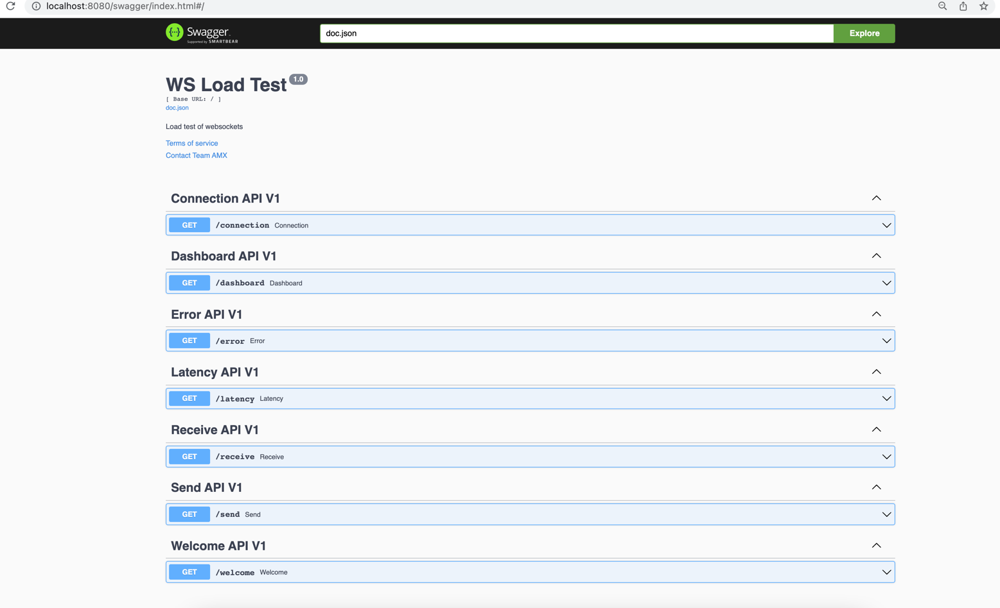

# Ws-load-test
The load testing library for websockets. Provide inbuild test strategies and allow users to develope own strategies for custom load tests

## Using ws-load-test

## Runtime Arguments

## Metrics

All metrics are exposed through a HTTP endpoint as a PNG.

### Swagger
Swagger link : http://localhost:8080/swagger/index.html#/

### Metrics
All metrics are emitted aggregated per minute

1. Send Message Count (http://localhost:8080/send)

2. Receive Message Count (http://localhost:8080/receive)

3. Total connections Count (http://localhost:8080/connection)

4. Error Count (http://localhost:8080/error)

5. Latency (http://localhost:8080/latency)

6. Dashboard. Overall dashboard containing all metrics (http://localhost:8080/dashboard)

## Strategies

There are 3 type of load testes which are supported by this library. 2 of these are supported out of the box. For custom strategy/test, a strategy logic need to be injected into code.

### Basic Message Publish
This is used to send a custom periodic message to ws server with provided configurations.

#### ./ws-load-test --host 172.31.25.37:8080 --protocol ws --requestCount 1000 --gapTime 500 --path /smart-stream --lifeTime 10 --strategy exchange_tick --writeTime 2

The above command will start test where a string "exchange_tick" will be send to ws server every 2 seconds. A total of 1000 requests will be created with a start up wait time of 500 ms between 2 established connections.

### Ping-Pong Strategy Publish
This is used to send a "ping" periodic message to ws server. This also handles the "pong" message which is sent from ws server.

#### ./ws-load-test --host 172.31.25.37:8080 --protocol ws --requestCount 1000 --gapTime 500 --path /mds --lifeTime 1 --strategy ping_pong --writeTime 1

The above command will start test with ping pong strategy. A total of 1000 requests will be created with a start up wait time of 500 ms between 2 established connections. Ping message will sent to ws server every 1 second.

### Custom  Load Test Strategy
This is used to send a "ping" periodic message to ws server. This also handles the "pong" message which is sent from ws server.

#### ./ws-load-test --host 172.31.25.37:8080 --protocol ws --requestCount 1000 --gapTime 500 --path /smart-stream --lifeTime 10 --strategy exchange_tick --writeTime 9999

Above example shows running a load test with custom strategy named exchange_tick. This strategy has a logic of sending a messge and receive stock markets ticks in  a streaming fashion. A total of 100 connections are made with a gap up time in 500 ms.

## Advanced Users/ Custom Strategy

   

